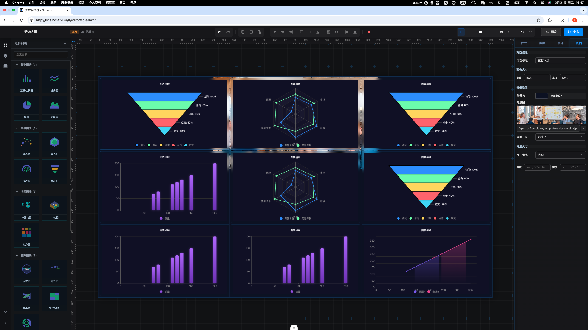

# Noco-Viz

<div align="center">


**零代码打造专业数据大屏**

[](LICENSE)

</div>




## 🚀 快速开始

### 在线体验

访问 [在线演示](http://viz.nocokit.cn) 立即体验:admin/123456


#### 手动部署

```bash
# 1. 克隆项目
git clone https://github.com/nocokit/noco-viz.git
cd noco-viz

# 2. 安装依赖
cd backend-node && npm install
cd ../frontend && pnpm install

# 3. 配置数据库
cp backend-node/.env.example backend-node/.env
# 编辑 .env 文件，配置数据库连接

# 4. 初始化数据库
cd backend-node
npm run migration:run
npm run seed

# 5. 启动服务
# 终端1 - 启动后端
cd backend-node && npm run start:dev

# 终端2 - 启动前端
cd frontend && pnpm dev

# 访问 http://localhost:5173
```


## 📄 开源协议

本项目采用 [Apache-2.0 License](LICENSE) 开源协议。

