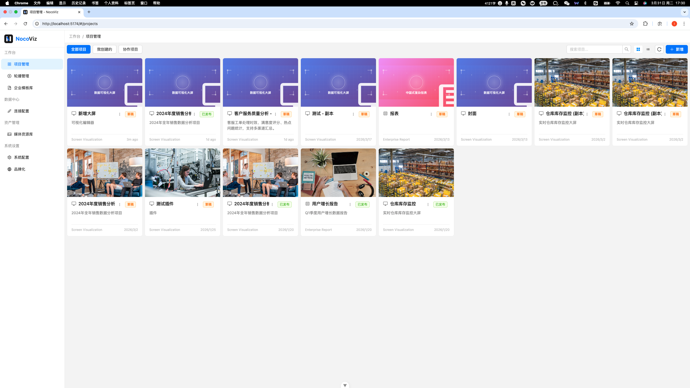

# Noco-Viz

<div align="center">


**零代码打造专业数据大屏**

[](LICENSE)

</div>




## ✨ 特性

- 🎨 **拖拽式设计** - 所见即所得的可视化编辑器
- 📊 **丰富的图表** - 30+ 种专业图表组件
- 🔌 **多数据源** - 支持 MySQL、PostgreSQL、API 等
- 🎯 **零代码** - 无需编程，3分钟上手
- 📱 **响应式** - 自适应各种屏幕尺寸
- 🚀 **高性能** - 基于 Vue 3 + ECharts
- 🔒 **企业级** - 完善的权限管理和安全机制

## 🚀 快速开始

### 在线体验

访问 [在线演示](https://viz.nocokit.com) 立即体验

### 本地部署

#### 使用 Docker（推荐）

```bash
# 克隆项目
git clone https://github.com/nocokit/noco-viz.git
cd noco-viz

# 启动服务
docker-compose up -d

# 访问 http://localhost:5173
```

#### 手动部署

**环境要求：**
- Node.js >= 18
- MySQL >= 8.0
- pnpm >= 8.0

```bash
# 1. 克隆项目
git clone https://github.com/nocokit/noco-viz.git
cd noco-viz

# 2. 安装依赖
cd backend-node && npm install
cd ../frontend && pnpm install

# 3. 配置数据库
cp backend-node/.env.example backend-node/.env
# 编辑 .env 文件，配置数据库连接

# 4. 初始化数据库
cd backend-node
npm run migration:run
npm run seed

# 5. 启动服务
# 终端1 - 启动后端
cd backend-node && npm run start:dev

# 终端2 - 启动前端
cd frontend && pnpm dev

# 访问 http://localhost:5173
```

默认账号：`admin` / `admin123`


## 🏗️ 技术栈

**前端：**
- Vue 3 + Vite
- ECharts 5
- Element Plus
- Pinia

**后端：**
- NestJS
- TypeORM
- MySQL
- JWT

## 🤝 贡献

我们欢迎所有形式的贡献！

- 🐛 [报告 Bug](https://github.com/nocokit/noco-viz/issues/new?template=bug_report.md)
- 💡 [提出新功能](https://github.com/nocokit/noco-viz/issues/new?template=feature_request.md)


## 📦 nocokit 产品矩阵

Noco-Viz 是 nocokit 产品矩阵的一部分：

- [noco-form](https://github.com/nocokit/noco-form) - 零代码表单构建器
- [noco-site](https://github.com/nocokit/noco-site) - 零代码建站工具（待开源）
- [noco-viz](https://github.com/nocokit/noco-viz) - 零代码数据可视化（本项目）

## 📄 开源协议

本项目采用 [Apache-2.0 License](LICENSE) 开源协议。

- ✅ 完全免费，可商业使用
- ✅ 可修改和分发
- ✅ 可用于闭源项目
- ✅ 无使用限制


- [GitHub Discussions](https://github.com/nocokit/noco-viz/discussions)


Made with ❤️ by [nocokit](https://github.com/nocokit)
